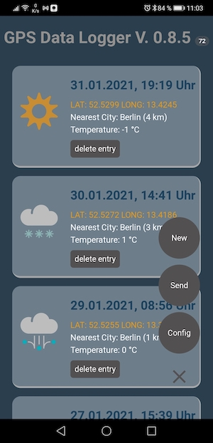
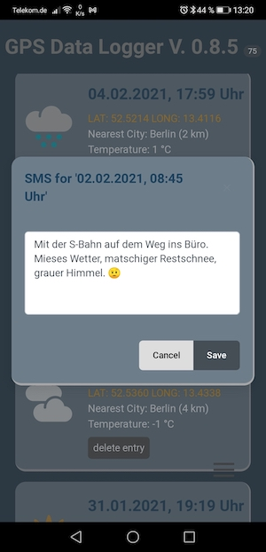

# Description

This is the counter part of my mobile Progressive Web App [GPS-Tracker](https://github.com/s01042/SimpleWebComponent).
This Web App visualizes my collected travel data on a timeline and a map. So friends and family can be informed about my location and wellbeing.

Once again I used web components for the implementation. This time i also implemented the 'non visual' web component [Applicaton.js](./components/Application.js) which 'glues together' the visual components of my app and the service component.

I encapsulated the handling of the leaflet map functionality in a [separate web component](./components/LeafletMapController.js). 

I reused the timeline from https://codepen.io/ritz078/pen/LGRWjE

I like it a lot! This timeline is responsive, works well on smaller displays such as smartphones and tablets, is touch aware and has key bindings for navigation. Kudos to the developer!

To get the flow of events of this timeline component well integrated into my own app i used a MutationObserver to get informed, especially about selection events in the timeline. For details look at the source code of the method installObserver in [Application.js](./components/Application.js).

# The flow of data

The PWA follows the "offline first" approach. With it i can collect the GPS data of my actual position. If connectivity is available i will also collect weather data by consuming a web service. I then can enrich this collected data with a short message text. In the first place I store this data locally on my mobile device, a Huawei P20 pro smartphone. If I'am connected to the internet the app then serialize this locally stored data into a JSON document and transfer it to my Google Drive account. 

Here are some screen shots of the PWA:

Anyplace is fetching this JSON document from Google Drive and deserialize the data therein into a simple object model. 

# Connecting the dots?

I could even go further and connecting the dots to show routing information on the map. For example:

https://gis.stackexchange.com/questions/299914/adjust-leaflet-routing-machine-draw-animate-route-speed

# TODO

Fix the CORS problem!

I'am still trapped by the CORS problem. I'm hosting Anyplace on GitHub pages where you can only deploy static web sites. There are no server side technologies available on GitHub pages on which I could have build my own CORS Proxy or some kind of web service proxy.

So GitHub pages is the origin of my web app. The JavaScript code of my app is running locally on the client device and in the client browser. That leads to the fact, that fetching the data from my Google Drive is a cross origin call always controlled by CORS. 

# Resumption

Another CORS proxy server was abused and is down now. So i implemented my own service proxy and host it on heroku. With this came new ideas: periodic background syncing and notifications came to my mind. 

# About periodic background sync

Periodic background sync is an extension of the background sync API. the goal is to regular force synchronisation events and update the locally (offline) stored data with fresh online data. the background sync API does not show any information in the apps gui. instead it delegates all the duty to the service worker.

The service worker can fetch new data at a regular intervall and compares this new data with the locally stored one. The service worker can than use notifications to inform the user about new data arrivals. 

In chromium browsers the permission for 'periodic-bakground-sync' is only granted, if the website is locally installed as an pwa. Since Chrome regards the installation of the application as implicit consent, there will be no permission request shown to the end user. 

Then the decision as to whether and how often a website can use the interface depends on its site engagement score. This is between 0 and 100 points, is influenced by the use of the website and can be viewed under chrome: // site-engagement.

The higher the score, the more often the events can be triggered, in the best case once a day.

# Try it

Use [this link](https://s01042.github.io/Anyplace/) to try the app.